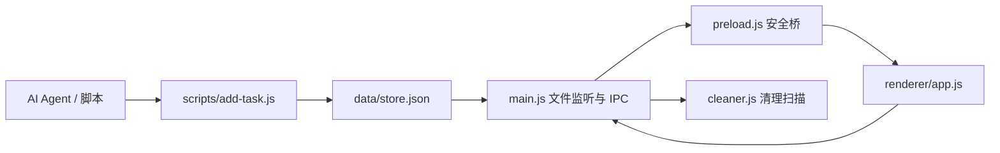

# TO-DO Panel

> 面向开发者的 Windows 贴顶工作台：平时完全隐藏，需要时用一次有意停顿唤醒；任务贴着真实项目走，也能由 AI Agent 从命令行直接写入。

[English](README.en.md) · [项目需求与创新点](docs/PRODUCT_BRIEF.zh-CN.md) · [二次开发指南](docs/DEVELOPMENT.md)

它不是又一个常驻桌面的待办窗口。TO-DO Panel 把项目、今日主线、工作区治理和开源发现放到一个可随时收起的工作台里，并让终端脚本和 AI Agent 成为一等任务入口。

## 最好玩的地方

### 1. 工作台平时“隐身”，只在你有意时出现

窗口默认隐藏。在 Windows 桌面中，鼠标停在屏幕顶部中央约 `140 × 6 px` 感应区至少 `350 ms` 才唤醒；鼠标按键按下、正在使用其他应用或快速划过时都会取消唤醒。没有常驻药丸，也尽量不打断拖文件、写代码和全屏操作。

### 2. 一屏串起项目、任务和每周成果

- **左栏：**活跃项目和本周完成记录；项目详情从左侧向外展开。
- **中栏：**快速录入与今日主线任务，优先呈现最重要的几项。
- **右栏：**开源项目雷达；详情向右侧展开，保持主任务区无遮挡。

### 3. AI Agent 不用复制粘贴，也能直接派活

`scripts/add-task.js` 支持普通参数、`--json` 和 `--file`，可以一次写入任务、项目代号、工作区路径、方案备忘和子任务。应用监听本地数据变化，外部脚本更新后会刷新任务区。

```powershell
node scripts/add-task.js --json '{"text":"检查发布文档","projectCode":"P35","planNotes":"核对需求与扩展入口","subtasks":["补 README","补开发指南"]}'
```

### 4. 清理构建垃圾时保住项目源码和关键版本

清理器扫描已登记的工作区，识别可重建缓存和版本文件族群，把识别出的稳定版、最新版标为保护项，再让用户审查并选择要清理的候选。选中项进入 Windows 回收站；清理成功后，项目及未完成任务才从应用的活跃列表移出。**项目源码目录会保留。**

### 5. 每晚看看 GitHub 上的新东西

开源雷达支持手动刷新和每日 `20:30` 复盘入口。它可匿名请求 GitHub，也可使用 GitHub Personal Access Token（PAT）：来源包括应用本地设置、`GITHUB_TOKEN` 或本机 `gh` 登录。PAT 是秘密凭据；在应用里输入的 PAT 会以明文保存到本机被 Git 忽略的 `data/store.json`。不要提交或分享该文件，并为 PAT 使用最小权限。

### 6. 终端关掉，工作台仍能留在托盘

Windows 下 `npm start` 通过 WMI 独立启动应用；`npm stop` 只向本应用发送退出请求，不会结束其他 Electron 程序。

## 运行

需要 Windows 10/11、Node.js/npm、PowerShell 和 Windows CIM/WMI。

```powershell
npm install
npm run start:dev   # 从当前终端启动，适合开发
npm start           # WMI 后台启动
npm stop            # 请求本应用优雅退出
npm test            # Electron 启动冒烟检查
```

`npm test` 目前只覆盖轻量启动路径，不验证唤醒交互、清理边界或界面操作。详细模块图、Agent 接入方式、IPC 扩展方法和当前移植限制见[二次开发指南](docs/DEVELOPMENT.md)。项目的需求来源、设计原则和差异点见[项目需求与创新点](docs/PRODUCT_BRIEF.zh-CN.md)。

## 从哪里开始二次开发

| 想扩展什么 | 主要入口 |
|---|---|
| 任务、项目与页面交互 | `renderer/app.js` |
| 布局和视觉 | `renderer/index.html`、`renderer/styles.css` |
| 主进程能力与窗口行为 | `main.js`、`preload.js` |
| 清理扫描和版本保护 | `cleaner.js` |
| Agent / 脚本录入任务 | `scripts/add-task.js` |

适合接手的改进包括：把个人 `Q:\` 路径改成用户配置、补齐 `desktop-guard.exe` 的 C# 源码与构建说明，以及为唤醒和清理流程增加交互测试。完整模块边界、IPC 约束和任务载荷格式见[二次开发指南](docs/DEVELOPMENT.md)。



## 项目边界

- 当前仅支持 Windows，顶部唤醒依赖 `scripts/desktop-guard.exe`。
- 仓库包含原生守护器二进制，但没有对应的 C# 源码和构建工程。
- Obsidian 根目录和个人工作区路径目前写在 `main.js` 与 `renderer/app.js`，新开发者需要先按自己的电脑调整。
- 清理操作移走应用里的项目记录与任务，不删除项目源码目录。
- 本地数据可能含个人路径和 GitHub Token，仓库规则会忽略它们。

## 许可证

MIT，详见 [LICENSE](LICENSE)。
