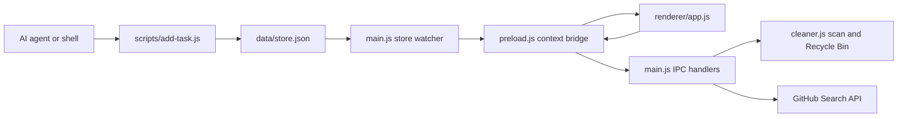

# TO-DO Panel

> A Windows desktop HUD for people who build things: it stays out of sight until you mean to use it, keeps tasks attached to real project workspaces, and gives AI agents a direct way to add work.

[简体中文](README.zh-CN.md) · [Product brief](docs/PRODUCT_BRIEF.zh-CN.md) · [Developer guide](docs/DEVELOPMENT.md)

TO-DO Panel is not another always-open task window. It is an intent-triggered workbench for project-based work: wake it with a deliberate hover, see the next few tasks beside the projects they belong to, and send tasks in from a terminal or AI agent without copy-pasting.

## The parts worth opening it for

### A HUD that waits for intent

The main window is hidden by default. On the Windows desktop, it wakes only when the pointer rests in a tiny top-center target (140 × 6 px) for at least 350 ms. A pressed mouse button, active application, or fast pointer movement cancels the wake-up. The goal is to avoid the always-visible pill and accidental pop-ups that interrupt dragging or coding.

### One workbench, three useful lanes

- **Projects and weekly wins:** keep active work and completed-task trophies in view.
- **Today's focus:** add a task quickly and keep the first few unfinished tasks visually prominent.
- **Open-source radar:** review curated GitHub projects and open their details in an outward-facing inspector that leaves the focus lane clear.

Project and radar inspectors open toward the outside edges, so details do not cover the center task lane.

### Let an AI agent add the task

The CLI accepts plain arguments, structured JSON, or a JSON file. A task can carry a project code, workspace path, plan notes, and subtasks. The running app watches its local store and refreshes when an external script changes it.

```powershell
node scripts/add-task.js --json '{"text":"Review the release flow","projectCode":"P35","planNotes":"Check the cleanup and README changes","subtasks":["Review docs","Check extension points"]}'
```

See the [CLI payload and extension guide](docs/DEVELOPMENT.md#agent-and-script-integration).

### Clean build clutter without deleting the project

The cleaner scans registered workspaces for rebuildable caches and versioned artifact families. It marks the recognized stable and latest files as protected, shows candidates for review, and sends selected items to the Windows Recycle Bin. If cleanup succeeds, the app removes that project and its unfinished tasks from the active list; the source directory stays on disk.

### A small evening window onto GitHub

The radar can fetch repository results from GitHub and has a daily 20:30 review path plus manual refresh. It can use a token from the app's local settings, `GITHUB_TOKEN`, or the local `gh` CLI login. Tokens and task data stay in the ignored local `data/` directory; do not commit that directory.

### Keep running after the terminal closes

On Windows, `npm start` asks WMI to launch the app as a separate process. The system-tray app remains available after the launching terminal exits. `npm stop` sends an app-specific quit request.

## How the pieces fit



## Run it

**Requirements:** Windows 10/11, Node.js/npm, PowerShell and Windows CIM/WMI for detached startup.

```powershell
npm install
npm run start:dev   # launch from the current terminal while developing
npm start           # detached Windows background launch
npm stop            # request a graceful app-specific exit
npm test            # lightweight Electron smoke launch
```

The current `npm test` path is a startup smoke check. It does not exercise pointer wake-up, task interactions, the GitHub radar, or cleanup failure cases. The app also currently enables Windows login startup from its normal startup path, including development launches; see the [developer notes](docs/DEVELOPMENT.md#current-development-boundaries).

## Build on it

Start with the [developer guide](docs/DEVELOPMENT.md) for the process map, CLI contract, IPC pattern, cleanup invariants, and current portability limits. The [product brief](docs/PRODUCT_BRIEF.zh-CN.md) records the original product goals and why the interaction works this way.

Good next contributions include moving the personal `Q:\` workspace map into user configuration, publishing the source/build steps for the native desktop guard, and adding interaction-level tests for wake-up and cleanup.

## Current boundaries

- Windows only. The top-edge wake-up depends on `scripts/desktop-guard.exe`.
- The native guard is checked in as a binary; its C# source/build project is not currently in this repository.
- Workspace and Obsidian paths are currently tied to this project's `Q:\` setup. The developer guide identifies the mapping locations.
- `data/store.json` may contain personal paths and a GitHub token. It is ignored by Git and must remain local.

## License

MIT. See [LICENSE](LICENSE).
