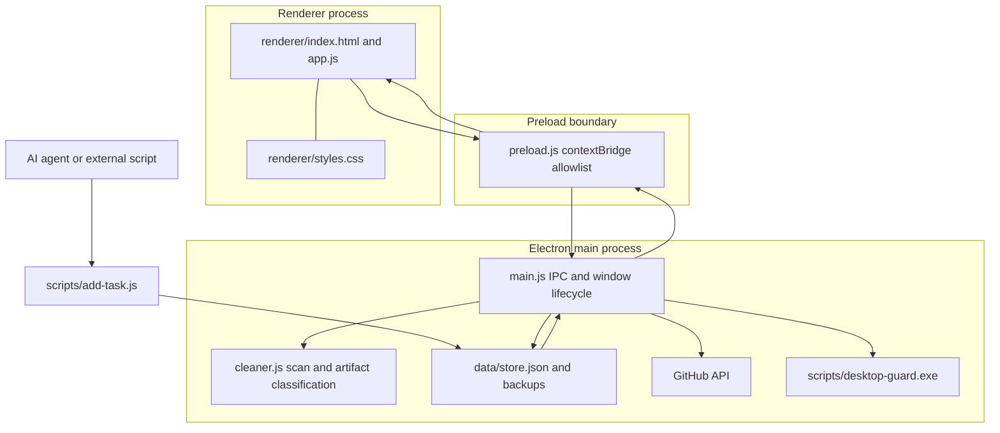

# Development Guide

This guide maps the current implementation and gives safe starting points for extending it. Product goals and interaction constraints are in the [product brief](PRODUCT_BRIEF.zh-CN.md); the user-facing feature overview is in the [README](../README.md).

## Prerequisites and commands

- Windows 10/11
- Node.js and npm
- PowerShell and Windows CIM/WMI for background launch
- `gh` CLI is optional; it can supply a GitHub API token for the radar

```powershell
npm install
npm run start:dev   # launch Electron from the current terminal
npm start           # launch through the detached WMI helper
npm stop            # request this app instance to quit
npm test            # lightweight Electron startup smoke path
```

The `npm test` script launches `main.js` with `--smoke-test`. It is not an interaction suite and does not exercise cleanup, pointer guards, or GitHub requests. `tests/smoke.electron.js` is present as a standalone test entry but is not the target of the current `npm test` script.

## Architecture map



## Where to change things

| Change | Start here | Keep in mind |
|---|---|---|
| Layout and visual tokens | `renderer/index.html`, `renderer/styles.css` | Keep the white-glass surface, text hierarchy, and focus lane consistent. |
| Task/project behavior | `renderer/app.js` | Keep project filters, selected items, popovers, and rendered tasks in sync when records change. |
| OS windows, tray, file access, or HTTP | `main.js` | Filesystem and network work belongs in the main process. Validate paths before cleanup. |
| Renderer-to-main API | `preload.js` plus a matching `ipcMain` handler in `main.js` | Add a narrow wrapper; keep `contextIsolation: true` and `nodeIntegration: false`. |
| Artifact scan and protection | `cleaner.js` | Add candidate classification and protection rules here; do not bypass the review selection or Recycle Bin path. |
| Agent task input | `scripts/add-task.js` | Preserve the plain, `--json`, and `--file` forms where practical. |
| Radar cards and schedule | `renderer/app.js`, `main.js` | Main process fetches GitHub; renderer displays data and tracks review state. Escape remote text before inserting HTML. |
| Desktop wake-up | `main.js`, `scripts/desktop-guard.exe` | The checked-in guard is binary-only; source and build instructions are not present. |

## Agent and script integration

`scripts/add-task.js` accepts a JSON object with these fields:

```json
{
  "text": "Review the release flow",
  "projectCode": "P35",
  "customPath": "Q:\\Todo",
  "planNotes": "Check user-facing behavior and failure paths",
  "subtasks": ["Update documentation", "Review cleanup states"]
}
```

Call it from PowerShell:

```powershell
node scripts/add-task.js --json '{"text":"Review the release flow","projectCode":"P35","planNotes":"Check failure paths","subtasks":["Read the docs","Review cleanup"]}'
```

For longer payloads, write JSON to a file and use `--file <path>`. The script prepends the new task to `data/store.json`; `main.js` watches that file with an 800 ms interval and sends `store-updated` to the renderer.

**Current write-path caveat:** the Electron `saveStore()` path writes a temporary file, renames it, and updates backups. The CLI currently writes the JSON file directly. External writes should be serialized with app saves; sharing an atomic-write helper is a useful hardening contribution.

## Adding an IPC capability

1. Add a narrow method to the object exposed by `contextBridge` in `preload.js`.
2. Add the corresponding `ipcMain.handle()` or event handler in `main.js`.
3. Call only the exposed method from `renderer/app.js`.
4. Validate input types, URLs, and filesystem paths in the main process.
5. Report partial failures explicitly; do not display success based only on requested item counts.

## Extending the workspace cleaner

The intended flow is:

1. The main process authorizes the registered workspace root.
2. `cleaner.js` scans and classifies candidates, marking protected stable/latest artifacts.
3. The renderer presents candidates and sends only the user's selected paths.
4. The main process rechecks path boundaries and sends selected items to the Windows Recycle Bin.
5. The renderer removes the active project/task records only when the cleanup result and store save meet the success conditions.

Preserve the source project folder. Do not make a Recycle Bin failure fall back to permanent deletion. When removing a project, also clear any UI state that points at it, including `activeProjectFilter` and its open inspector.

## Extending the GitHub radar

`main.js` resolves a token from the request, app settings, `GITHUB_TOKEN`, or `gh auth token`, then queries the GitHub Search API. The renderer merges returned items into `store.techRadar` and displays them in the right lane. The built-in cards also provide tag, title, metric, summary, quote, pain, cure, URL, and star metadata. Keep the shape expected by `renderRadar()` and `openRightPopover()`, and continue escaping remote text before HTML insertion.

The UI offers a daily 20:30 refresh/review path and a manual refresh. API credentials stored in `data/store.json` are local plaintext settings; use a least-privilege token and never commit the store file.

## Current development boundaries

### Personal path mapping

`REAL_WORKSPACE_MAP` contains `Q:\` workspace paths in both `main.js` and `renderer/app.js`. Obsidian project discovery also reads `Q:\Obsidian_KB`. New contributors must replace these paths for their machine. Moving the mapping to a per-user configuration file is a strong first contribution.

### Native helper source

The repository includes `scripts/desktop-guard.exe`, but no C# source project or build instructions. The top-edge wake-up relies on this helper to report mouse/button and desktop state. Contributors cannot currently rebuild that component from this repository alone.

### Development startup side effect

The main process currently enables Windows login startup in its normal ready path. Development and smoke launches use the same path, so repeated local runs can update that setting. A follow-up improvement should guard auto-start registration in dev/test mode.

### Local data and credentials

`data/store.json` and `data/backups/` are machine-local and Git-ignored. They may contain project paths, task text, and a GitHub token. Do not stage or share them.

### Test coverage

The current package test command is a startup smoke check. It does not prove visual behavior, cleanup safety, filter reset, or Windows wake-up conditions. Add fixture-based tests before changing destructive cleanup logic, and use disposable workspaces for filesystem validation.

## Contribution checklist

- Keep personal paths, task data, and tokens out of commits.
- Keep renderer APIs behind the preload allowlist.
- Preserve current files and task state when reviewing a contributor's local checkout.
- Include a concise description of the user-visible behavior and a screenshot/recording for UI changes.
- Separate what was statically inspected from what was actually run.
